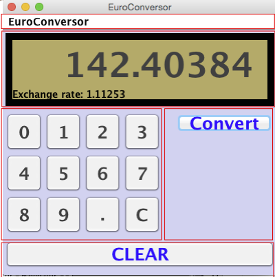

# EuroConversor



## Descripción
EuroConversor es una aplicación de escritorio desarrollada en **Java** utilizando el patrón de diseño **MVC (Modelo-Vista-Controlador)**. Permite realizar conversiones de divisas, gestionando diferentes tasas de cambio a través de una interfaz gráfica (Swing).
 
Este proyecto fue desarrollado para la asignatura de **Entorno de Usuario (EU)** en la **Universitat de València** en 2021.

## Características
* **Interfaz Gráfica:** Diseño basado en paneles independientes para teclado numérico, operaciones y visualización.
* **Arquitectura MVC:** Separación clara entre la lógica de negocio, la interfaz y el control de eventos.

## Instalación y Ejecución

1.  **Clonar el repositorio:**
    ```bash
    git clone [https://github.com/IvaanEscudero/EuroConversor.git](https://github.com/IvaanEscudero/EuroConversor.git)
    ```
2.  **Abrir en NetBeans:**
    * Abre NetBeans IDE.
    * File > Open Project > Selecciona la carpeta `EuroConversor`.
3.  **Ejecutar:**
    * Haz clic derecho sobre el proyecto y selecciona **Run**.

## Tecnologías usadas
* **Lenguaje:** Java
* **Librerías:** Java Swing (GUI)
* **IDE:** NetBeans
